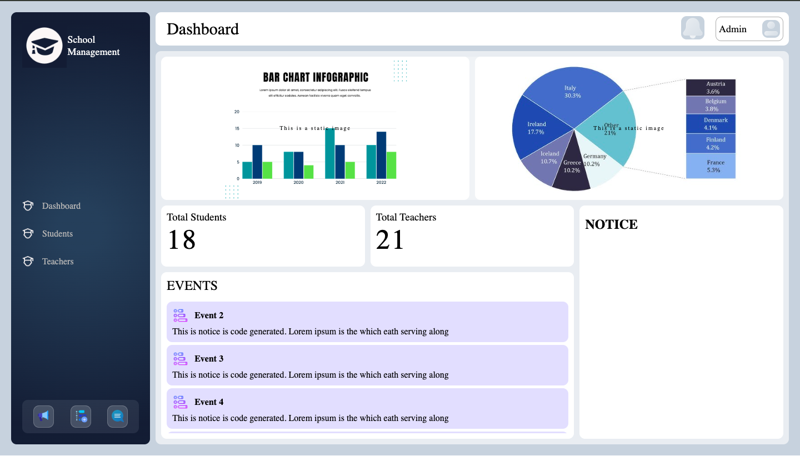
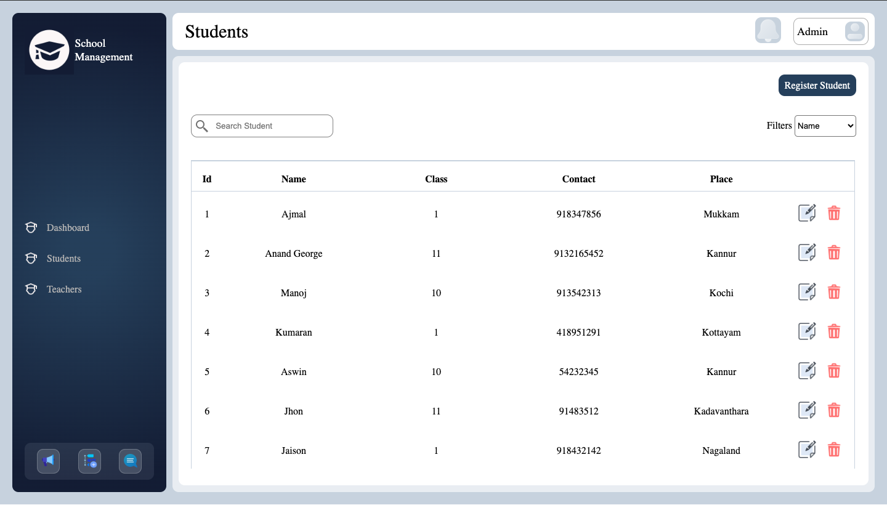
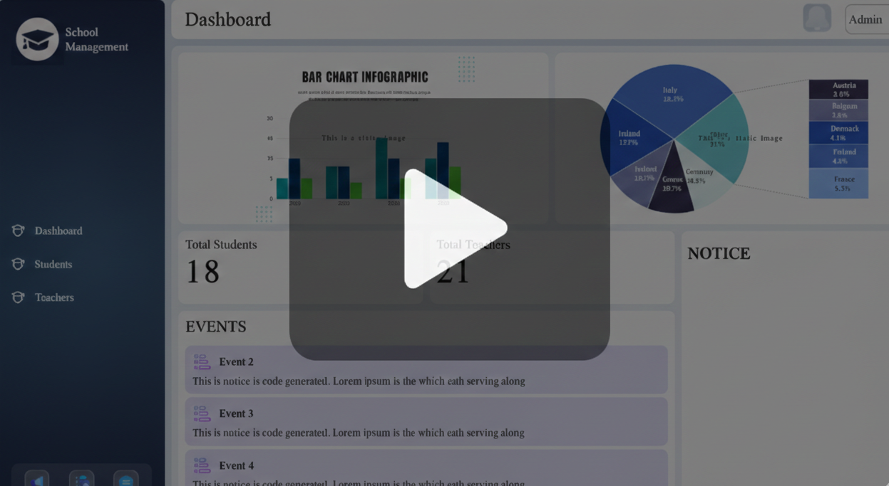
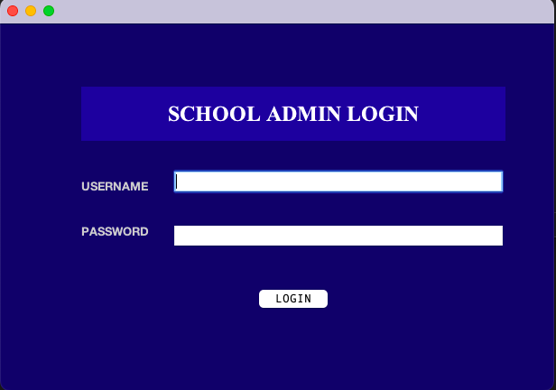
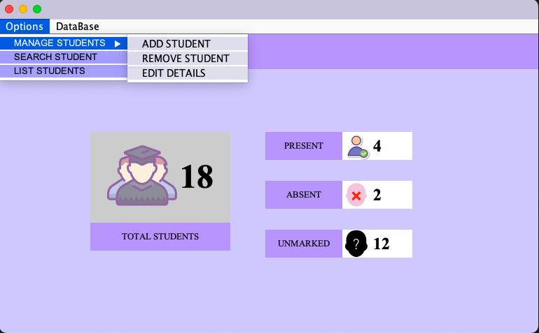
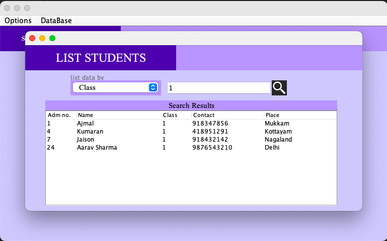

# School Management Evolution

A **learning-driven, multi-platform Java project** that tracks the evolution of a single domain (school administration) across desktop and web technologies during a structured Java training program.

This repository documents _how concepts were learned and applied incrementally_, rather than presenting a production-ready system.

> This repository is not actively maintained and is not intended for further updates.

## Overview

This project was developed during a Java software development course, serving as a continuous learning exercise.
Each new topic introduced during the course (UI development, JDBC, MVC, ORM, web technologies) was progressively integrated into the same problem domain.

Instead of creating isolated demos, a single domain was intentionally reused to observe architectural growth and design trade-offs over time.

## Motivation & Learning Context

The goal of this project was not rapid feature completion, but **progressive learning**.

Key objectives included:

- Applying new Java concepts as they were introduced
- Understanding MVC-style separation
- Exploring desktop vs web application architectures
- Iteratively refining data access and UI layers

As a result, the codebase reflects experimentation, refactoring, and evolution.

## Current State

### Web Application (More Complete)

- JSP + Servlets following an MVC-style structure
- Hibernate-based persistence layer
- MySQL database
- Full CRUD operations for core entities
- Dashboard-oriented UI
- Limited AJAX usage for dynamic updates

### Desktop Application (Learning Prototype)

- Java Swing–based UI
- JDBC / Hibernate integration
- Full CRUD functionality for the **Student** entity
- Basic, functional UI without advanced styling
- Intentionally not migrated to JavaFX

## Screenshots

### Web Application

#### Demo Video

### Desktop Application

## Tech Stack

- **Language:** Java
- **Desktop:** Java Swing
- **Web:** JSP, Servlets
- **Persistence:** JDBC, Hibernate
- **Database:** MySQL
- **Build Tool:** Ant (NetBeans-managed project)

## Repository Structure (High Level)

- `desktop-version/` — Swing-based desktop prototype
- `web-version/` — JSP/Servlet-based web application
- `screenshots`

## Versioning & History

The commit history reflects **topic-by-topic learning**, not linear feature delivery.

Major refactors, UI redesigns, and architectural transitions are intentionally preserved to document the learning process.  
Selected milestones are marked using Git tags.

## Status

**Archived / Learning Project**

- The project meets its learning objectives
- No active development is planned
- No modernization (Spring Boot, JavaFX, etc.) is intended

## Local Setup (Reference Only)

> This project is archived. The following steps are provided solely to help re-run the application locally if needed for reference.

### Prerequisites

- JDK 8–11 (recommended for compatibility)
- Apache Tomcat 9.x
- MySQL 8.x
- NetBeans (recommended for Ant-based web execution)

### Database

1. Start MySQL server.
2. Create a database (e.g. `school_management`).
3. Import the SQL schema if available, or allow Hibernate to create tables automatically.
4. Update database credentials in the configuration files used by the web and desktop modules.

### Web Application

- Open the project in NetBeans.
- Configure Apache Tomcat 9 as the server.
- Run the project using the NetBeans Ant `run` action.
- Access via: `http://localhost:8080/SchoolWebApp`

### Desktop Application

- Open the desktop module in the IDE.
- Ensure database configuration matches the web module.
- Run the main Swing entry class.

**No further development or modernization is planned.**

---

## What This Project Is — and Is Not

**This project is:**

- A record of applied learning
- A demonstration of incremental improvement
- A comparison of desktop and web approaches within the same domain

**This project is not:**

- A production-ready school management system
- A polished UI showcase
- An example of modern enterprise Java practices

## Key Takeaway

This repository captures the _process of learning and evolution_, not just the final result.

It is preserved as a reference for architectural growth.
